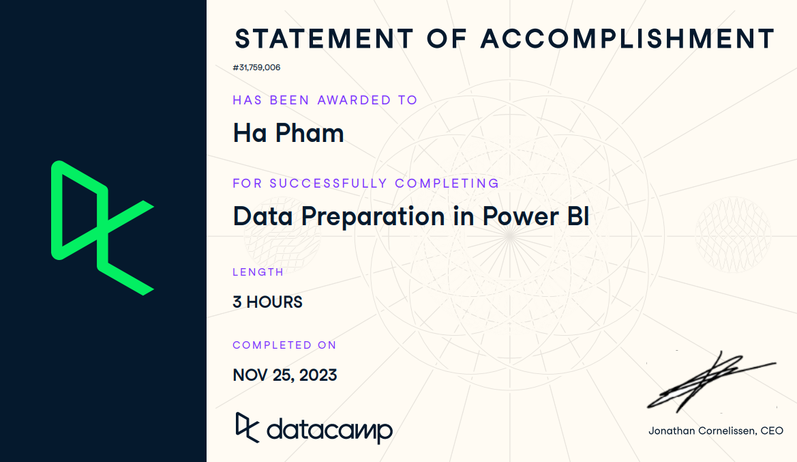

## Course Description
In this interactive Power BI course, learn:
- Chapter 1 - how to use Power Query Editor to transform and shape your data to be ready for analysis
- Chapter 2 - Data Preview features in Power Query
- Chapter 3 - data manipulation
- Chapter 4 - Numerical transformations in Power Query

