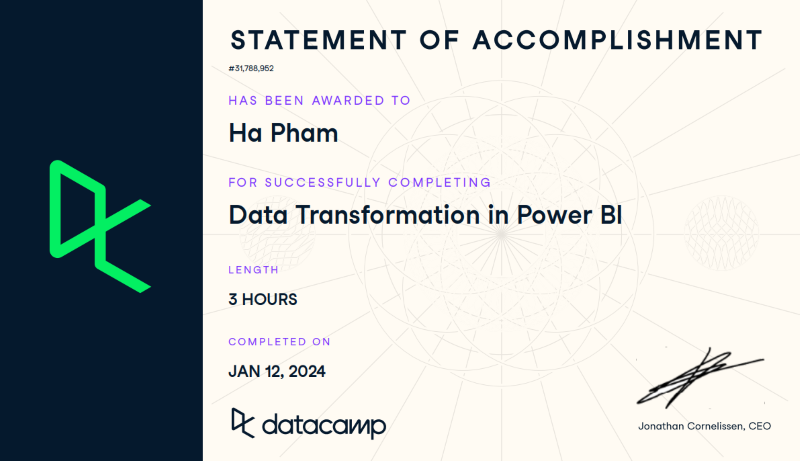

## Course Description
- Chapter 1 - Learn how to (un)pivot, transpose, and append tables.
- Chapter 2 - How to join and discover when it makes sense to use them.
- Chapter 3 - Custom columns, including how to use M language
- Chapter 4 - the Advanced Editor to help be even more efficient in data preparation.

## Certificate

